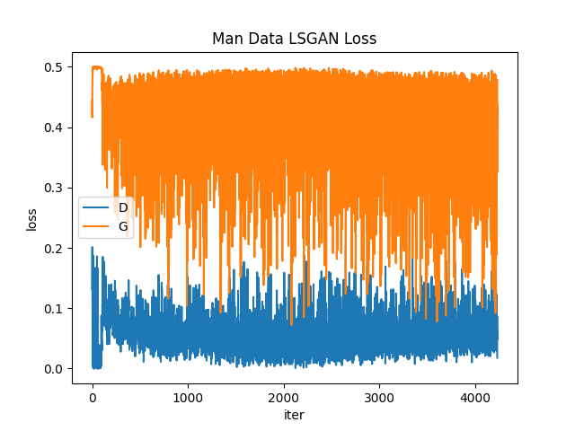
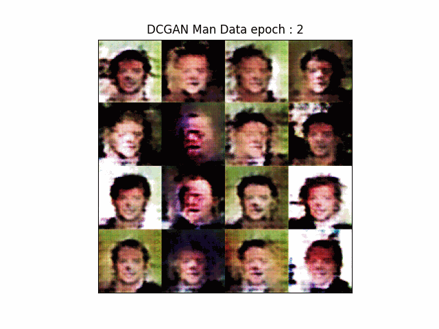
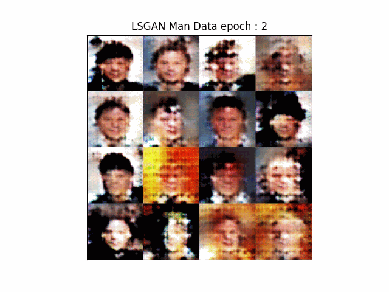

# LSGAN
 

### Datasets
-------------------
<a href='https://mmlab.ie.cuhk.edu.hk/projects/CelebA.html'>CelebA</a> : 약 20k개의 연예인 얼굴 datasets

  

### Model
-------------------
LSGAN

<a href='https://drive.google.com/drive/folders/1danZgK_eBRnnBUR43JkTtwnAptNxPJg4?usp=drive_link'>Weights</a>

  

DCGAN 모델이서 Tanh를 제거

### Train
-------------------
epochs : 10, learning rate : 0.0005, optimizer : Adam(Beta1, 2 = 0.5), Loss : Least Square Loss  
Man Data

 

### Result
-------------------
#### 1. D, G Loss

  

#### 2. DCGAN vs LSGAN Inference(Epoch = 2, 4, 6, 8, 10)
1. DCGAN

  

2. LSGAN

  

